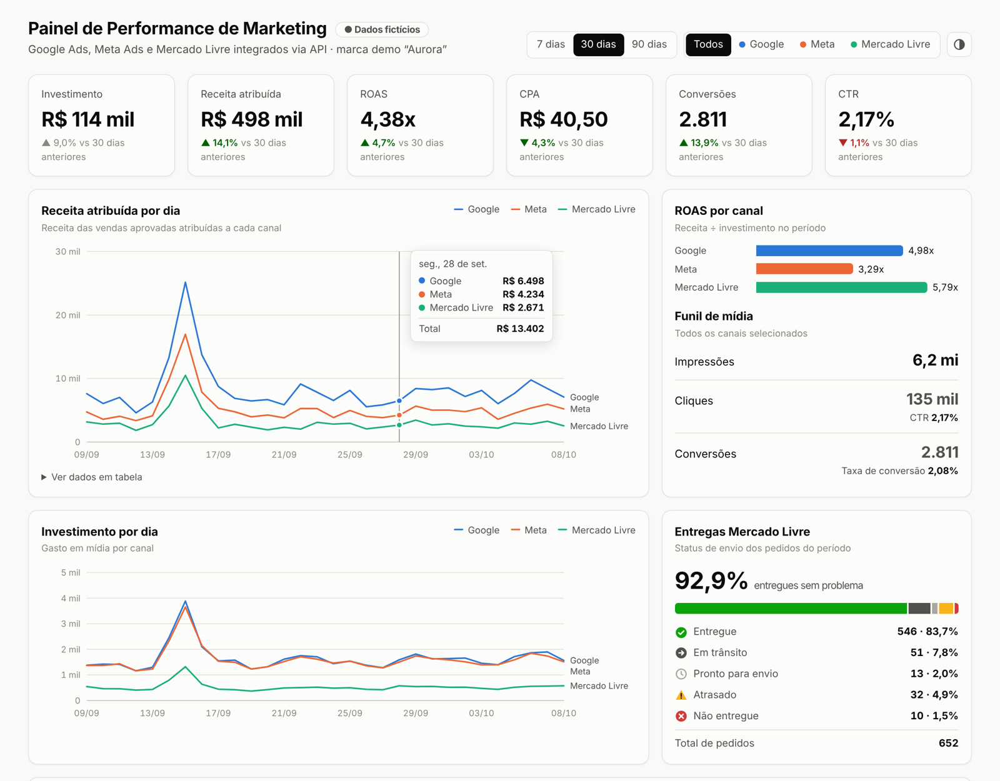
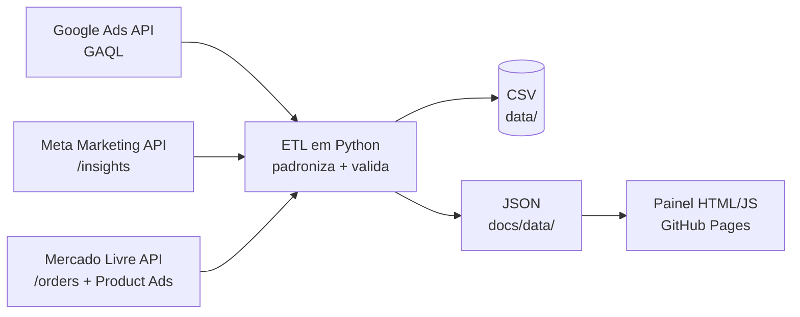

# 📈 Painel de Performance de Marketing (Martech)

Painel que reúne **Google Ads, Meta Ads e Mercado Livre** em uma única visão, cruzando a mídia paga com as **vendas aprovadas no CRM**. O objetivo é responder rápido à pergunta que importa: *onde o investimento em marketing está trazendo retorno?*

> ⚠️ **Todos os dados deste repositório são fictícios.** Eles são gerados por `src/demo_data.py` imitando o formato real de cada API. Nenhum número vem de empresa real.

**🔗 [Ver o painel funcionando](https://josemauriciofarias.github.io/martech-performance-dashboard/)**

<picture>
  <source media="(prefers-color-scheme: dark)" srcset="docs/assets/preview-dark.png">
  
</picture>

---

## O que o painel mostra

| Bloco | Pergunta que responde |
|---|---|
| **KPIs** (investimento, receita, ROAS, CPA, conversões, CTR) | Como está o período em relação ao anterior? |
| **Receita e investimento por dia** | Quando a receita sobe, o gasto acompanha? Picos de campanha aparecem? |
| **ROAS por canal** | Qual canal devolve mais por real investido? |
| **Funil de mídia** | Onde o público se perde: impressão, clique ou compra? |
| **Tabela de campanhas** | Quais campanhas estão saudáveis, em atenção ou críticas? |
| **Entregas Mercado Livre** | A operação está entregando no prazo? |
| **CRM** | Quanto da receita total vem da mídia paga? Quantos pedidos ainda estão em análise? |

Filtros por **período** (7, 30, 90 dias) e **canal**, tooltip com os valores do dia, tabela de dados para acessibilidade e **tema claro/escuro**.

## Como funciona



Cada plataforma devolve os dados num formato diferente, e o ETL resolve isso:

- **Google Ads:** custo vem em *micros* (R$ 1 = 1.000.000) → convertido para reais
- **Meta Ads:** números chegam como *texto* e as compras ficam dentro de listas de `actions` → convertidos e extraídos
- **Mercado Livre:** um registro por pedido, com status de envio → agregado por dia e status

Depois tudo vira **um esquema único** (`date, channel, campaign, spend, impressions, clicks, conversions, revenue`) e passa por **validações de qualidade**: datas vazias, valores negativos, cliques maiores que impressões e linhas duplicadas.

## Estrutura

```
├── src/
│   ├── connectors/
│   │   ├── google_ads.py      # consulta GAQL (google-ads)
│   │   ├── meta_ads.py        # Graph API /insights com paginação
│   │   └── mercado_livre.py   # /orders/search com paginação
│   ├── demo_data.py           # gera dados fictícios no formato de cada API
│   └── pipeline.py            # ETL: extrai, padroniza, valida e exporta
├── data/                      # saídas em CSV (fictícias)
└── docs/                      # painel publicado no GitHub Pages
    ├── index.html
    └── data/dashboard.json
```

## Rodando localmente

```bash
pip install -r requirements.txt
python -m src.pipeline          # gera os dados fictícios e o JSON do painel
python -m http.server -d docs   # abre em http://localhost:8000
```

Para usar as APIs reais, copie `.env.example` para `.env`, preencha as credenciais e rode `python -m src.pipeline --live`.

## Métricas

| Métrica | Fórmula |
|---|---|
| ROAS | receita atribuída ÷ investimento |
| CPA | investimento ÷ conversões |
| CTR | cliques ÷ impressões |
| Taxa de conversão | conversões ÷ cliques |
| Participação da mídia | receita atribuída ÷ receita aprovada no CRM |

**Venda = pedido aprovado.** Pedidos em análise ficam separados e não entram na receita.

## Tecnologias

Python · Pandas · APIs REST (Google Ads, Meta, Mercado Livre) · HTML · CSS · JavaScript (SVG puro, sem bibliotecas de gráfico) · GitHub Pages

---

Feito por **José Mauricio Farias** · [LinkedIn](https://www.linkedin.com/in/jmsf1994/)
